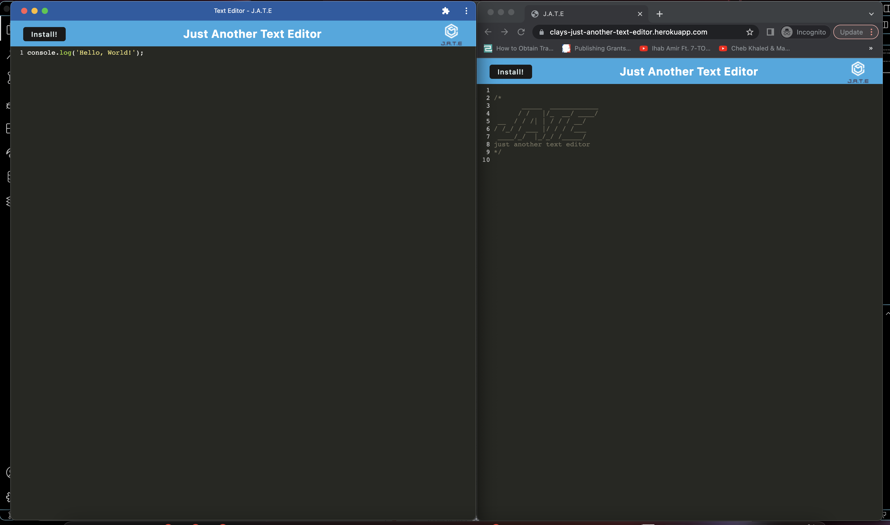

# Text Editor Starter Code

## Description

This is a single-page site that functions as a text editor. It runs in your browser or as a stand alone application that you can install on your computer. This PWA employs a number of data persistance techniques and works with a variety of browsers.

## Usage

In order to use this text editor, you can go to [Clay's Just another text editor](https://clays-just-another-text-editor.herokuapp.com/). The app is deployed using Heroku and can be installed locally on your machine by clicking "Install". 

 ## Screenshots
[]

## Questions 

 If you have any questions, email me at cmckee120993@gmail.com. 

 You can view more of my work at [cmckee120993](https://github.com/cmckee120993).